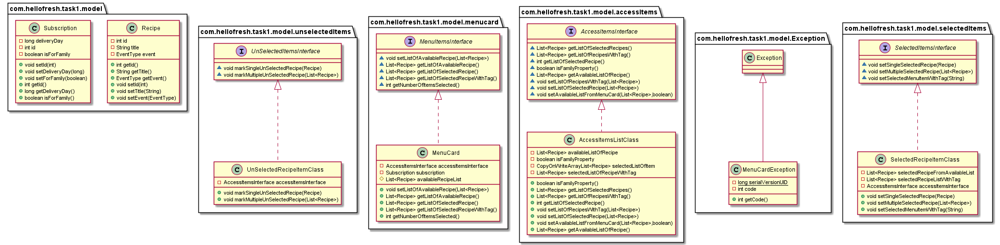
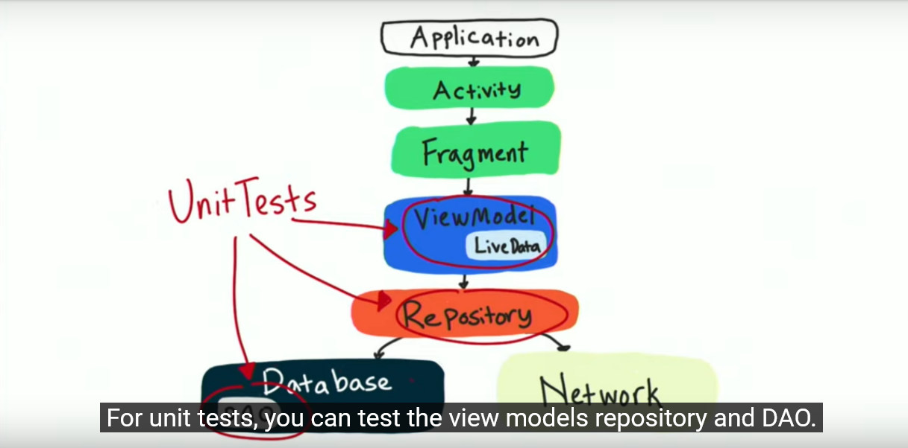
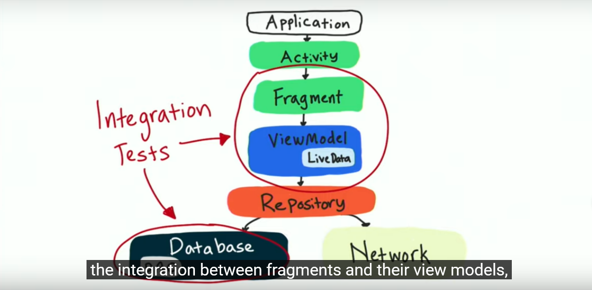
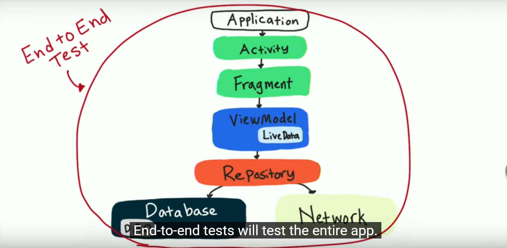
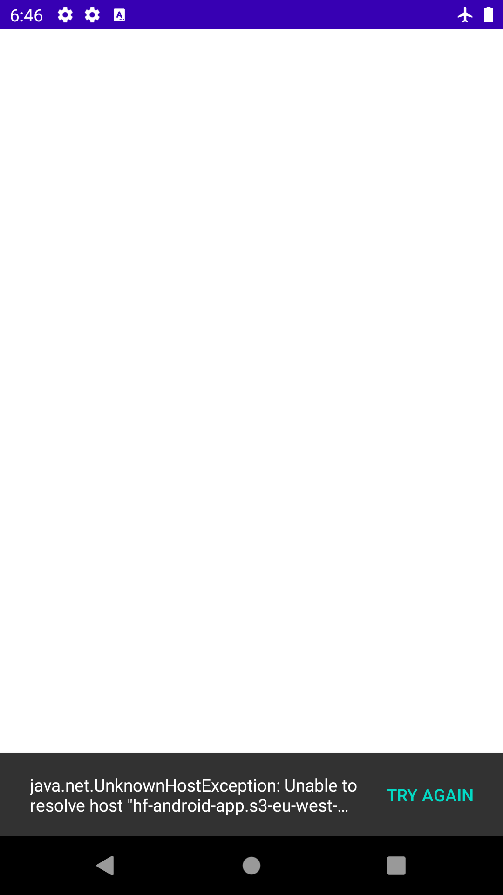
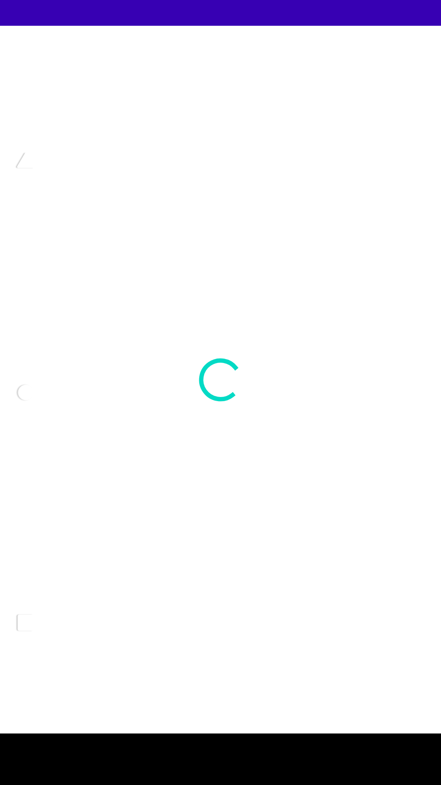
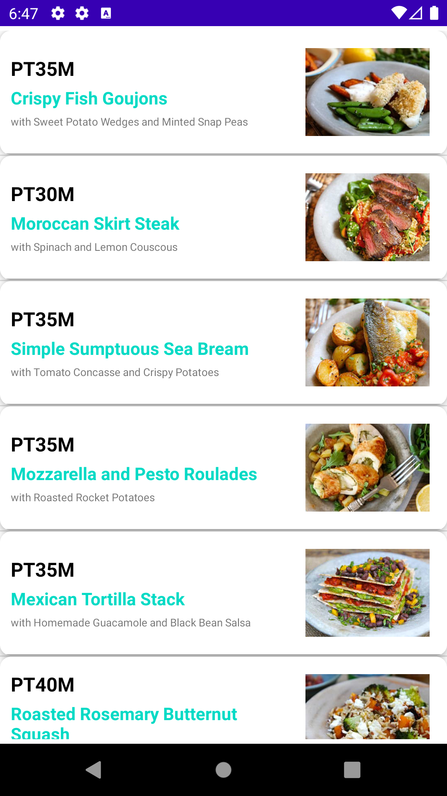
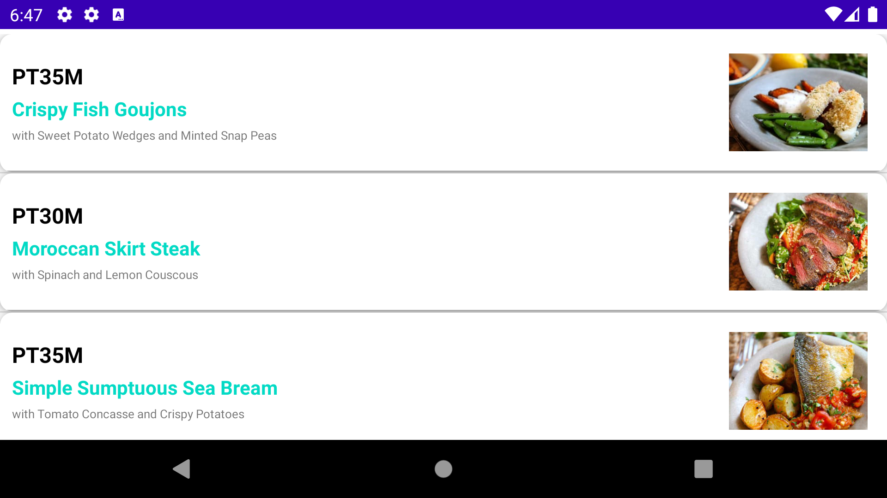

# android-test-2.0

Hello! Thank you for taking the time to try our Android test. The goal of the test is to assess your coding and design skills. You will have to complete two exercises — design a simple implementation of the Menu Feature (Exercise 1) and create a simple single-page application showcasing the recipes (Exercise 2).

**Note 1:** Exercise 1 and Exercise 2 are not related in any way and should be handled separately.

**Note 2:** While we love open source here at HelloFresh, please do not create a public repo with your test in! This challenge is only shared with people interviewing, and for obvious reasons, we'd like it to remain this way.

### Instructions

- Clone this repo.
- Create a new dev branch.
- Implement Exercise 1 in the `task1` module, and Exercise 2 in the `task2` module.
- Create a pull request against the master branch of this repo.
- After creating your pull request, please send the link via email to our HR department in order for us to start the reviewing process.

### Tips on How to Tackle the test

- Schedule a specific time to tackle the test.
- Be well rested and choose a quiet place with no interruptions.
- Read the instructions and requirements carefully, and feel free to ask any questions.
- Identify technical decisions you need to make and sketch out an initial plan.
- Start coding and commit often.
- Please consider Clean Code Principles.
- Enrich the code with comments and include clear instructions.

## Exercise I - Menu Code Kata

### Initial configuration

The idea of the first exercise is to design a simple implementation of a Menu feature based on the requirements listed below. Technical implementation is up to you, but all decisions should be listed in the README file with a short description of the reasonings.  We don't expect you to invest more than 2 hours on this exercise.

For the purpose of this task we will assume the following:  
A Recipe is a data structure with an id, title, and a list of tags associated with it. Examples of tags can be "hot", "quick", "low-calories", etc. Recipes are equal if their ids are equal. A Subscription is a data structure with id, delivery day, and isForFamily properties.

You will be creating and adding behaviors to a Menu model:

- A list of recipes available for selection is provided to the menu. 
- Menu exposes a list of recipes available for selection.
- Menu has a reference to an associated subscription.

### Requirements

- Keep SOLID principles in mind while you are working on this exercise
- Do not develop any UI for this exercise
- Unit and/or integration tests should be part of this exercise

**Selecting recipes in the menu**

- You should be able to mark a single recipe as selected.
- You should be able to mark multiple recipes as selected.
- You should be able to ask the menu how many recipes have been selected.

**Unselecting recipes in the menu**

- You should be able to unselect a single selected recipe.
- You should be able to unselect multiple selected recipes.

**Accessing recipes in the menu**

- You should be able to request a list of selected recipes.
- You should be able to request a list of recipes which have a certain tag.

**Restricting the behavior**

- You should not be able to select more than 3 recipes.

**Modifying the behavior based on subscription type**

- You should be able to select up to 5 recipes if the subscription is for a family.
 
*Note*

- Don’t forget to notify calling code about errors where appropriate.
- The Recipe data structure is final. Please do not add more properties to it.

## 📷 Screenshots

 
 
## Exercise II -  Recipes List View 

## Recipes List Application
A simple single-page application showcasing the list recipes.
A sample application to demonstrate how to use Jetpack Architecture Components in an Android Application following the Clean MVVM Architecture concepts.

### Design & Testing Consideration. 

-MVVM android design pattern with Clean Architecture separates your view (i.e. Activitys and Fragments) from your business logic.It goes one step further in separating the responsibilities of your code base. It clearly abstracts the logic of the actions that can be performed in your app.

Advantages of Using MVVM with  Clean Architecture

    1-Your code is even more easily testable as the code base is divided into Presentation layer , Domain(Use Case) layer and Data Layer.
    2-Your code is further decoupled (the biggest advantage.)
    3-The package structure is even easier to navigate.
    4-The project is even easier to maintain.
    5-Your team can add new features even more quickly.
    
Testing Strategy 

Points

1-Test as much we can like Utils class and other small class which can be easily testable.
2-Focus more on Junit testing then Integration or End to End Testing.
3-Architecture your application is such a way that maximum testablity can be achieved.
4-Set a code coverage base limit (example 60% ) for your application and try to increase it further.

Use tools like Essperso, Mockito etcs .

Below are the image taken from Udacity Nano degree Program where I have learned the testing strategy.

## 📷 Screenshots for testing stratery <Images Credit goes to Udacity Nano degree Program>
 

  
## ⚙ Tech used
- Recipe Api
- Kotlin
- Model-View-Viewmodel Architecture
- Navigation component
- Room database
- Retrofit 2
- GSON
- Moshi
- Kotlin Courtines.
- Glide.
-Data-Binding.

This app demonstrates the following views and techniques from the below documentation.

* [Retrofit](https://square.github.io/retrofit/) to make api calls to an HTTP web service.
* [Moshi](https://github.com/square/moshi) which handles the deserialization of the returned JSON to Kotlin data objects. 
* [Glide](https://bumptech.github.io/glide/) to load and cache images by URL.

  
It leverages the following components from the Jetpack library:

* [ViewModel](https://developer.android.com/topic/libraries/architecture/viewmodel)
* [LiveData](https://developer.android.com/topic/libraries/architecture/livedata)
* [Data Binding](https://developer.android.com/topic/libraries/data-binding/) with binding adapters
* [Navigation](https://developer.android.com/topic/libraries/architecture/navigation/) with the SafeArgs plugin for parameter passing between fragments

## 🚀 Features & Suggested Workflow Completed.

- The app should show a single view.
- At launch, the app should show a loading spinner while it gets the data from the source. 
- When the data is fetched, the app should hide the loading spinner and show the recipes’ view.
- Show the current date in “dd  MMM” format (20 Aug) with text size 18sp as a first element of the recipes list view.
- Recipes in the list are presented as cards with image, title and headline. Title should be in bold with text size 16sp.
- If an error occurred, you should show a snackbar with a short description of the issue.

## 📷 Screenshots

## 🎯 Requirements
- Android 5.0 and Above
- Min sdk version 21

## 💻 Permissions
- Internet

